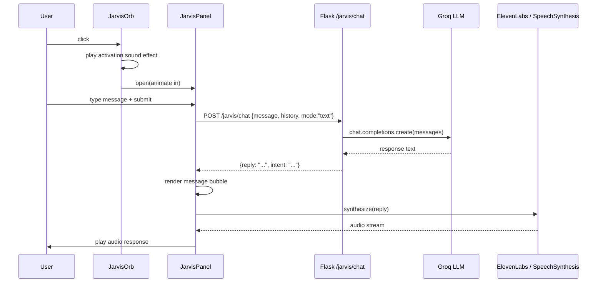
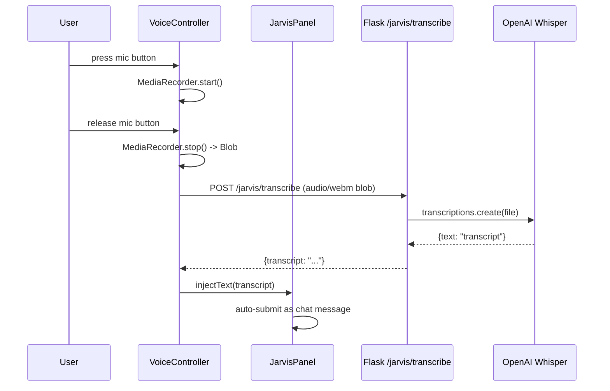
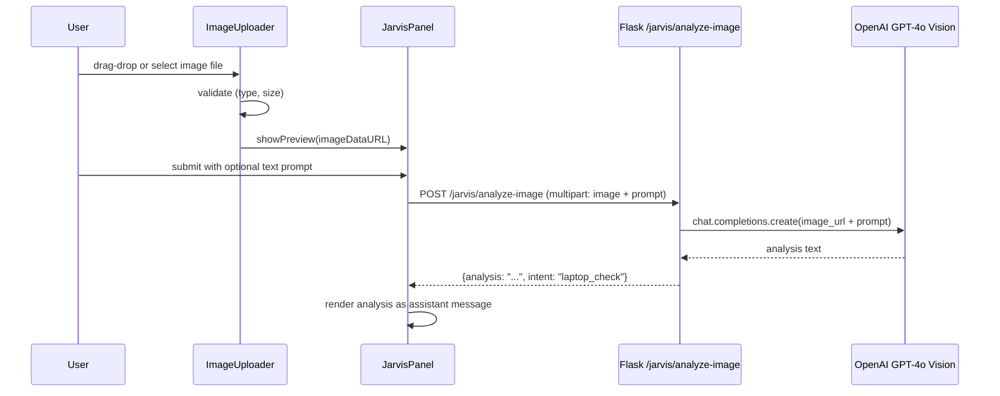

# Design Document: Jarvis AI Assistant

## Overview

The Jarvis AI Assistant is a futuristic, voice-and-vision-capable AI overlay built on top of the existing PCAdvisor laptop recommendation system. It presents as an animated, clickable holographic orb embedded in the PCAdvisor frontend. When activated, it opens a full-featured chatbot panel that supports text, voice, and image-based interactions, powered by the existing Groq/LLM backend extended with new Flask endpoints for speech and image processing.

The assistant preserves all existing laptop recommendation functionality while adding a new interaction layer: users can speak naturally, upload images of laptops or receipts, and receive both text and spoken responses from a Jarvis-style AI persona. The design prioritises progressive enhancement — the core recommendation flow continues to work unchanged, and the Jarvis assistant is an additive overlay that can be dismissed at any time.

The system is architected as a thin React component tree injected into the existing static `index.html` page (or optionally served as a separate React SPA), communicating with three new Flask API endpoints (`/jarvis/chat`, `/jarvis/transcribe`, `/jarvis/analyze-image`) that sit alongside the existing `/recommend` endpoint. No breaking changes are made to the existing codebase.

---

## Architecture

```mermaid
graph TD
    subgraph Frontend ["Frontend (Browser)"]
        A[PCAdvisor index.html] --> B[JarvisOrb Component]
        B -->|click| C[JarvisPanel Component]
        C --> D[ChatWindow]
        C --> E[VoiceController]
        C --> F[ImageUploader]
        D --> G[MessageList]
        D --> H[InputBar]
        E -->|Web Speech API / Whisper| I[TranscriptHandler]
        F -->|File input| J[ImagePreview]
    end

    subgraph Backend ["Backend (Flask)"]
        K[app.py - existing]
        L[/jarvis/chat]
        M[/jarvis/transcribe]
        N[/jarvis/analyze-image]
        K --> L
        K --> M
        K --> N
        L --> O[Groq LLM - llama-3.3-70b]
        M --> P[OpenAI Whisper API]
        N --> Q[OpenAI Vision API / GPT-4o]
    end

    subgraph Audio ["Audio Layer"]
        R[ElevenLabs TTS API]
        S[Browser SpeechSynthesis fallback]
    end

    C -->|fetch POST| L
    C -->|fetch POST multipart| M
    C -->|fetch POST multipart| N
    L -->|text response| C
    M -->|transcript text| C
    N -->|image analysis text| C
    L -->|trigger TTS| R
    R -->|audio stream| C
    C -->|fallback| S
```

---

## Sequence Diagrams

### Flow 1: User Clicks Orb and Sends Text Message



### Flow 2: Voice Input



### Flow 3: Image Upload and Analysis



---

## Components and Interfaces

### Component 1: JarvisOrb

**Purpose**: The always-visible animated entry point. A rotating holographic orb rendered in CSS/SVG with particle effects. Clicking it activates the assistant.

**Interface**:
```typescript
interface JarvisOrbProps {
  onActivate: () => void
  isActive: boolean
  position: 'bottom-right' | 'hero-center'
}

interface OrbAnimationState {
  isRotating: boolean
  isGlowing: boolean
  isPulsing: boolean
  activationInProgress: boolean
}
```

**Responsibilities**:
- Render animated SVG orb with CSS keyframe rotations and glow effects
- Play Jarvis-style activation sound on click (Web Audio API)
- Transition to "active" visual state when panel is open
- Remain accessible (keyboard focusable, ARIA label)

---

### Component 2: JarvisPanel

**Purpose**: The main chatbot window that slides in after orb activation. Contains all sub-components and manages overall assistant state.

**Interface**:
```typescript
interface JarvisPanelProps {
  isOpen: boolean
  onClose: () => void
}

interface JarvisPanelState {
  messages: Message[]
  isLoading: boolean
  voiceEnabled: boolean
  currentMode: 'text' | 'voice' | 'image'
  pendingImage: ImageAttachment | null
}

interface Message {
  id: string
  role: 'user' | 'assistant'
  content: string
  timestamp: Date
  imageUrl?: string
  audioUrl?: string
}
```

**Responsibilities**:
- Manage conversation history (in-memory, session-scoped)
- Coordinate between ChatWindow, VoiceController, and ImageUploader
- Send requests to Flask backend
- Trigger TTS playback after each assistant response
- Handle loading/error states

---

### Component 3: VoiceController

**Purpose**: Manages microphone recording and speech-to-text transcription.

**Interface**:
```typescript
interface VoiceControllerProps {
  onTranscript: (text: string) => void
  onError: (error: VoiceError) => void
}

interface VoiceControllerState {
  isRecording: boolean
  isTranscribing: boolean
  permissionGranted: boolean
}

type VoiceError =
  | { code: 'PERMISSION_DENIED' }
  | { code: 'TRANSCRIPTION_FAILED'; message: string }
  | { code: 'NO_SPEECH_DETECTED' }
```

**Responsibilities**:
- Request microphone permission via `navigator.mediaDevices.getUserMedia`
- Record audio using `MediaRecorder` API (webm/opus format)
- Send audio blob to `/jarvis/transcribe`
- Inject transcript into chat input
- Show visual recording indicator (animated waveform)

---

### Component 4: ImageUploader

**Purpose**: Handles image file selection, validation, preview, and submission.

**Interface**:
```typescript
interface ImageUploaderProps {
  onImageSelected: (attachment: ImageAttachment) => void
  onImageCleared: () => void
}

interface ImageAttachment {
  file: File
  previewUrl: string
  name: string
  sizeBytes: number
}

interface ImageValidationResult {
  valid: boolean
  error?: 'FILE_TOO_LARGE' | 'UNSUPPORTED_TYPE' | 'CORRUPTED'
}
```

**Responsibilities**:
- Accept drag-and-drop or file picker input
- Validate: max 10 MB, types jpg/png/webp only
- Generate preview URL via `FileReader`
- Attach image to next chat submission

---

### Component 5: TTSController

**Purpose**: Manages text-to-speech output, with ElevenLabs as primary and browser SpeechSynthesis as fallback.

**Interface**:
```typescript
interface TTSControllerProps {
  enabled: boolean
  voice: 'elevenlabs' | 'browser'
}

interface TTSController {
  speak(text: string): Promise<void>
  stop(): void
  isSpeaking(): boolean
}
```

**Responsibilities**:
- Call ElevenLabs `/v1/text-to-speech/{voice_id}` with streaming
- Fall back to `window.speechSynthesis.speak()` if ElevenLabs unavailable
- Expose stop/mute controls
- Queue multiple utterances

---

### Component 6: Flask Jarvis Blueprint (Backend)

**Purpose**: New Flask Blueprint (`jarvis_bp`) added to `app.py` providing three endpoints.

**Interface**:
```python
# Route signatures
POST /jarvis/chat
  Body: { "message": str, "history": list[dict], "context": str | None }
  Response: { "reply": str, "intent": str }

POST /jarvis/transcribe
  Body: multipart/form-data, field "audio" (webm blob)
  Response: { "transcript": str }

POST /jarvis/analyze-image
  Body: multipart/form-data, fields "image" (jpg/png/webp) + "prompt" (str)
  Response: { "analysis": str, "intent": str }
```

**Responsibilities**:
- Validate and sanitize all inputs
- Maintain Jarvis system persona in LLM system prompt
- Route laptop-related intents to existing `get_relevant_laptops()` logic
- Handle API key errors gracefully with user-friendly messages

---

## Data Models

### Model 1: ChatRequest

```typescript
interface ChatRequest {
  message: string          // max 2000 chars
  history: HistoryEntry[]  // last 10 turns max
  context?: string         // optional: "laptop_recommendation"
}

interface HistoryEntry {
  role: 'user' | 'assistant'
  content: string
}
```

**Validation Rules**:
- `message` must be non-empty string, max 2000 characters
- `history` array max length 20 entries (10 turns)
- Each `content` in history max 4000 characters

---

### Model 2: ChatResponse

```typescript
interface ChatResponse {
  reply: string
  intent: 'general' | 'laptop_recommendation' | 'image_analysis' | 'greeting'
  error?: string
}
```

---

### Model 3: TranscribeResponse

```typescript
interface TranscribeResponse {
  transcript: string
  confidence?: number
  error?: string
}
```

---

### Model 4: ImageAnalysisRequest / Response

```typescript
interface ImageAnalysisRequest {
  image: File          // jpg/png/webp, max 10 MB
  prompt?: string      // optional user question about the image
}

interface ImageAnalysisResponse {
  analysis: string
  intent: string
  error?: string
}
```

**Validation Rules**:
- Image file types: `image/jpeg`, `image/png`, `image/webp` only
- Max file size: 10 MB
- `prompt` max 500 characters

---

## Algorithmic Pseudocode

### Algorithm 1: Jarvis Chat Handler (Flask)

```pascal
ALGORITHM handle_jarvis_chat(request)
INPUT: request containing message, history, optional context
OUTPUT: ChatResponse with reply and intent

BEGIN
  ASSERT request.message IS NOT NULL AND LENGTH(request.message) <= 2000
  ASSERT LENGTH(request.history) <= 20

  // Build system prompt with Jarvis persona
  system_prompt ← build_jarvis_system_prompt(request.context)

  // Detect intent from message
  intent ← detect_intent(request.message)

  // If laptop intent, enrich context with dataset
  IF intent = "laptop_recommendation" THEN
    laptop_context ← get_relevant_laptops_from_message(request.message)
    system_prompt ← system_prompt + "\n\nLaptop Data:\n" + laptop_context
  END IF

  // Build messages array for LLM
  messages ← [{ role: "system", content: system_prompt }]
  FOR each turn IN request.history DO
    messages.append({ role: turn.role, content: turn.content })
  END FOR
  messages.append({ role: "user", content: request.message })

  // Call Groq LLM
  response ← groq_client.chat.completions.create(
    model = "llama-3.3-70b-versatile",
    messages = messages,
    temperature = 0.8,
    max_tokens = 1024
  )

  reply ← response.choices[0].message.content

  ASSERT reply IS NOT NULL AND LENGTH(reply) > 0

  RETURN { reply: reply, intent: intent }
END
```

**Preconditions**:
- `request.message` is non-null, non-empty, max 2000 chars
- `request.history` is a list of at most 20 `{role, content}` dicts
- Groq client is initialized with valid API key

**Postconditions**:
- Returns `ChatResponse` with non-empty `reply`
- `intent` is one of the defined intent strings
- No mutation of global state

**Loop Invariants**:
- All history entries appended to `messages` maintain `role` ∈ {`user`, `assistant`}

---

### Algorithm 2: Intent Detection

```pascal
ALGORITHM detect_intent(message)
INPUT: message string
OUTPUT: intent string

BEGIN
  message_lower ← LOWERCASE(message)

  laptop_keywords ← ["laptop", "recommend", "budget", "gaming", "cpu", "ram",
                      "storage", "price", "lkr", "buy", "spec", "processor"]

  FOR each keyword IN laptop_keywords DO
    IF keyword IN message_lower THEN
      RETURN "laptop_recommendation"
    END IF
  END FOR

  IF message_lower STARTS_WITH "hello" OR "hi" OR "hey" OR "jarvis" THEN
    RETURN "greeting"
  END IF

  RETURN "general"
END
```

**Preconditions**:
- `message` is a non-null string

**Postconditions**:
- Returns exactly one of: `"laptop_recommendation"`, `"greeting"`, `"general"`
- No side effects

**Loop Invariants**:
- Each keyword checked is a lowercase string; comparison is case-insensitive

---

### Algorithm 3: Voice Recording and Transcription (Frontend)

```pascal
ALGORITHM record_and_transcribe()
INPUT: user microphone stream
OUTPUT: transcript string

BEGIN
  // Request permission
  stream ← AWAIT navigator.mediaDevices.getUserMedia({ audio: true })
  IF stream IS NULL THEN
    THROW VoiceError("PERMISSION_DENIED")
  END IF

  // Start recording
  recorder ← NEW MediaRecorder(stream, { mimeType: "audio/webm;codecs=opus" })
  chunks ← []

  ON recorder.dataavailable DO
    chunks.append(event.data)
  END ON

  recorder.start()
  SET isRecording ← true

  // Wait for user to stop (button release or timeout)
  AWAIT user_stop_signal OR timeout(30_000ms)

  recorder.stop()
  SET isRecording ← false

  // Assemble blob
  audioBlob ← NEW Blob(chunks, { type: "audio/webm" })

  IF SIZE(audioBlob) < 1000 THEN
    THROW VoiceError("NO_SPEECH_DETECTED")
  END IF

  // Send to backend
  formData ← NEW FormData()
  formData.append("audio", audioBlob, "recording.webm")

  response ← AWAIT fetch("/jarvis/transcribe", {
    method: "POST",
    body: formData
  })

  result ← AWAIT response.json()

  ASSERT result.transcript IS NOT NULL

  RETURN result.transcript
END
```

**Preconditions**:
- Browser supports `MediaRecorder` API
- User has granted microphone permission

**Postconditions**:
- Returns non-empty transcript string on success
- Throws typed `VoiceError` on failure
- Microphone stream is always stopped (finally block)

**Loop Invariants**:
- `chunks` array grows monotonically during recording; no chunks are removed

---

### Algorithm 4: TTS with Fallback

```pascal
ALGORITHM speak_response(text, voice_mode)
INPUT: text string, voice_mode ("elevenlabs" | "browser")
OUTPUT: audio playback (side effect)

BEGIN
  ASSERT text IS NOT NULL AND LENGTH(text) > 0

  IF voice_mode = "elevenlabs" THEN
    TRY
      audio_stream ← AWAIT elevenlabs_api.text_to_speech(
        voice_id = JARVIS_VOICE_ID,
        text = text,
        model = "eleven_monolingual_v1"
      )
      audio_element ← NEW Audio(audio_stream)
      AWAIT audio_element.play()
      RETURN
    CATCH api_error
      // Fall through to browser fallback
      LOG("ElevenLabs TTS failed, using browser fallback")
    END TRY
  END IF

  // Browser SpeechSynthesis fallback
  utterance ← NEW SpeechSynthesisUtterance(text)
  utterance.rate ← 1.0
  utterance.pitch ← 0.9
  utterance.voice ← SELECT voice WHERE name CONTAINS "Male" OR lang = "en-US"
  window.speechSynthesis.speak(utterance)
END
```

**Preconditions**:
- `text` is non-empty
- Browser supports `SpeechSynthesis` (fallback path)

**Postconditions**:
- Audio playback is initiated
- If ElevenLabs fails, browser TTS is used without throwing
- No mutation of message state

---

### Algorithm 5: Image Analysis Handler (Flask)

```pascal
ALGORITHM handle_image_analysis(request)
INPUT: multipart request with image file and optional prompt
OUTPUT: ImageAnalysisResponse

BEGIN
  image_file ← request.files.get("image")
  prompt ← request.form.get("prompt", "Describe this image in detail.")

  ASSERT image_file IS NOT NULL
  ASSERT image_file.content_type IN ["image/jpeg", "image/png", "image/webp"]
  ASSERT SIZE(image_file) <= 10_485_760  // 10 MB

  // Encode image to base64
  image_bytes ← image_file.read()
  image_b64 ← base64.encode(image_bytes)
  data_url ← "data:" + image_file.content_type + ";base64," + image_b64

  // Call OpenAI GPT-4o Vision
  response ← openai_client.chat.completions.create(
    model = "gpt-4o",
    messages = [{
      role: "user",
      content: [
        { type: "image_url", image_url: { url: data_url } },
        { type: "text", text: prompt }
      ]
    }],
    max_tokens = 1024
  )

  analysis ← response.choices[0].message.content
  intent ← detect_intent(analysis + " " + prompt)

  ASSERT analysis IS NOT NULL

  RETURN { analysis: analysis, intent: intent }
END
```

**Preconditions**:
- `image_file` is present in request
- File type is one of the allowed MIME types
- File size ≤ 10 MB
- OpenAI API key is configured

**Postconditions**:
- Returns non-empty `analysis` string
- `intent` is a valid intent string
- Image bytes are not persisted to disk

---

## Key Functions with Formal Specifications

### Frontend: `sendMessage(message, attachment?)`

```typescript
async function sendMessage(
  message: string,
  attachment?: ImageAttachment
): Promise<Message>
```

**Preconditions**:
- `message.trim().length > 0` OR `attachment !== undefined`
- `message.length <= 2000`
- Panel is open and not currently loading

**Postconditions**:
- A new user `Message` is appended to `messages` state
- A new assistant `Message` is appended after response
- `isLoading` returns to `false` after completion
- TTS is triggered with assistant reply text

---

### Frontend: `buildConversationHistory(messages)`

```typescript
function buildConversationHistory(messages: Message[]): HistoryEntry[]
```

**Preconditions**:
- `messages` is a valid array (may be empty)

**Postconditions**:
- Returns last min(10, messages.length) turns as `HistoryEntry[]`
- Each entry has `role` ∈ `{'user', 'assistant'}` and non-empty `content`
- System messages are excluded

**Loop Invariants**:
- Slice index never exceeds array bounds

---

### Backend: `build_jarvis_system_prompt(context?)`

```python
def build_jarvis_system_prompt(context: str | None) -> str
```

**Preconditions**:
- `context` is either `None` or a non-empty string

**Postconditions**:
- Returns a non-empty string containing the Jarvis persona instructions
- If `context` is `"laptop_recommendation"`, prompt includes laptop advisor instructions
- Prompt always includes PCAdvisor branding and Sri Lanka context

---

## Example Usage

```typescript
// 1. User opens Jarvis panel by clicking orb
const handleOrbClick = () => {
  playActivationSound()  // Web Audio API
  setIsPanelOpen(true)
}

// 2. User sends a text message
await sendMessage("What laptop should I buy for gaming under LKR 200,000?")
// → Backend detects "laptop_recommendation" intent
// → Enriches prompt with ML-filtered laptop data
// → Returns recommendation text
// → TTS speaks the response

// 3. User records voice input
const transcript = await recordAndTranscribe()
// transcript = "recommend a laptop for video editing"
await sendMessage(transcript)

// 4. User uploads a laptop image
const attachment = await selectImage()
// attachment = { file: File, previewUrl: "data:image/jpeg;base64,..." }
await sendMessage("Is this a good deal?", attachment)
// → Backend sends image to GPT-4o Vision
// → Returns analysis: "This appears to be an ASUS VivoBook..."

// 5. TTS speaks the response
await ttsController.speak(assistantReply)
```

---

## Correctness Properties

- For all messages `m` where `m.length > 0` and `m.length <= 2000`, `sendMessage(m)` must resolve without throwing and append exactly two new entries to `messages` (one user, one assistant).
- For all audio blobs `b` where `b.size >= 1000` bytes, `transcribeAudio(b)` must return a non-empty string transcript.
- For all image files `f` where `f.type ∈ {jpeg, png, webp}` and `f.size <= 10MB`, `analyzeImage(f)` must return a non-empty analysis string.
- For all calls to `detectIntent(message)`, the return value must be one of `{"laptop_recommendation", "greeting", "general"}`.
- For all calls to `speak(text)` where `text.length > 0`, audio playback must be initiated within 3 seconds (ElevenLabs) or 500ms (browser fallback).
- The existing `/recommend` endpoint must remain unaffected by the addition of the Jarvis blueprint — all existing tests must continue to pass.
- For all `ChatRequest` objects where `history.length > 20`, the backend must return HTTP 400 before calling the LLM.

---

## Error Handling

### Error Scenario 1: Microphone Permission Denied

**Condition**: User denies microphone access when clicking the mic button.
**Response**: Show inline error message "Microphone access is required for voice input. Please allow access in your browser settings." Mic button shows error state (red icon).
**Recovery**: User can dismiss and continue with text input. Button resets to idle state.

---

### Error Scenario 2: LLM API Failure

**Condition**: Groq API returns 5xx or network timeout on `/jarvis/chat`.
**Response**: Backend returns `{ error: "AI service temporarily unavailable. Please try again." }` with HTTP 503. Frontend shows error bubble in chat.
**Recovery**: User can retry the same message. Conversation history is preserved.

---

### Error Scenario 3: Image Too Large or Wrong Type

**Condition**: User selects a file > 10 MB or a non-image file type.
**Response**: Frontend validates before upload and shows inline error: "Please upload a JPG, PNG, or WebP image under 10 MB."
**Recovery**: File is rejected; user can select a different file. No request is sent to backend.

---

### Error Scenario 4: ElevenLabs TTS Quota Exceeded

**Condition**: ElevenLabs API returns 429 or quota error.
**Response**: TTSController silently falls back to browser `SpeechSynthesis`. No error is shown to user.
**Recovery**: Automatic — browser TTS plays the response. A subtle indicator may show "Using browser voice."

---

### Error Scenario 5: No Speech Detected in Recording

**Condition**: User records audio but the resulting blob is < 1 KB (silence or very short clip).
**Response**: Frontend shows: "No speech detected. Please try again." Recording indicator resets.
**Recovery**: User can press mic button again to re-record.

---

## Testing Strategy

### Unit Testing Approach

Test each component and utility function in isolation using Jest + React Testing Library.

Key unit tests:
- `detectIntent()` returns correct intent for all keyword combinations
- `buildConversationHistory()` correctly trims to last 10 turns
- `validateImageFile()` rejects oversized and wrong-type files
- `build_jarvis_system_prompt()` includes persona text and optional context
- Flask route handlers return correct HTTP status codes for invalid inputs

---

### Property-Based Testing Approach

**Property Test Library**: fast-check (frontend), Hypothesis (backend)

Key properties to test:
- For any string `s` with `0 < len(s) <= 2000`, `detect_intent(s)` always returns a valid intent string (never throws, never returns null)
- For any `messages` array of length `n`, `buildConversationHistory(messages)` returns an array of length `min(n, 10)` with all entries having valid `role` values
- For any image file with `size > 10_485_760`, `validateImageFile()` always returns `{ valid: false, error: 'FILE_TOO_LARGE' }`
- For any `history` array with `length > 20`, the Flask `/jarvis/chat` endpoint always returns HTTP 400

---

### Integration Testing Approach

- End-to-end test: orb click → panel open → text message → response rendered → TTS triggered
- Voice flow: mic button → recording → transcription → message injected → response
- Image flow: file selected → preview shown → submitted → analysis rendered
- Existing `/recommend` endpoint continues to return valid recommendations after Jarvis blueprint is registered

---

## Performance Considerations

- **Conversation history**: Capped at 10 turns (20 messages) sent to LLM to control token usage and latency. Older messages are kept in UI but not sent to backend.
- **Audio recording**: `MediaRecorder` uses `opus` codec for efficient compression. Max recording duration is 30 seconds to prevent oversized uploads.
- **Image upload**: Client-side validation prevents large files from being sent. Images are base64-encoded in memory and not written to disk on the server.
- **TTS streaming**: ElevenLabs streaming API is used to begin playback before the full audio is downloaded, reducing perceived latency.
- **Orb animation**: CSS-only animations (no JavaScript animation loops) to avoid blocking the main thread. `will-change: transform` applied to animated elements.
- **Panel open/close**: CSS transitions with `transform` and `opacity` (GPU-composited properties) for smooth 60fps animation.

---

## Security Considerations

- **API key management**: ElevenLabs and OpenAI API keys are stored in environment variables (`.env` file), never hardcoded or exposed to the frontend. The existing Groq key in `app.py` should be migrated to `api.env`.
- **Input sanitization**: All user text inputs are stripped of leading/trailing whitespace and length-validated before being sent to the LLM. No raw HTML is injected into the DOM — assistant responses are rendered as plain text or via a safe markdown renderer.
- **File upload security**: Image files are validated by MIME type and size on both client and server. Files are processed in memory and never persisted to disk, eliminating path traversal risks.
- **CORS**: The existing `flask_cors` CORS configuration should be tightened to allow only the PCAdvisor origin in production.
- **Rate limiting**: The `/jarvis/chat`, `/jarvis/transcribe`, and `/jarvis/analyze-image` endpoints should be rate-limited (e.g., 20 requests/minute per IP) to prevent abuse and runaway API costs.
- **Content moderation**: The Jarvis system prompt instructs the LLM to stay on-topic (laptop advice and general assistance) and decline harmful requests.

---

## Dependencies

### Frontend (new)
- `react` + `react-dom` ^18 — component framework (or vanilla JS if React is not added)
- `web-speech-api` — browser built-in, no package needed
- `elevenlabs` JS SDK or direct fetch to ElevenLabs REST API
- `marked` — already included in `index.html` for markdown rendering

### Backend (new)
- `openai` ^1.0 — for Whisper transcription and GPT-4o Vision (`pip install openai`)
- `python-dotenv` — for loading API keys from `api.env` (`pip install python-dotenv`)
- `flask-limiter` — for rate limiting new endpoints (`pip install flask-limiter`)

### External APIs
- **Groq API** — already integrated, used for Jarvis chat responses
- **OpenAI Whisper API** — speech-to-text transcription
- **OpenAI GPT-4o Vision API** — image analysis
- **ElevenLabs API** — high-quality Jarvis-style TTS voice synthesis
